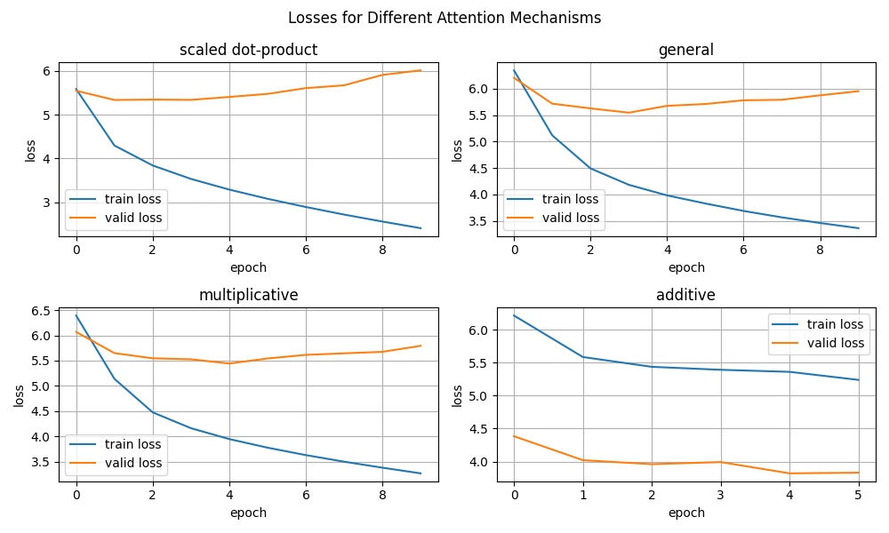
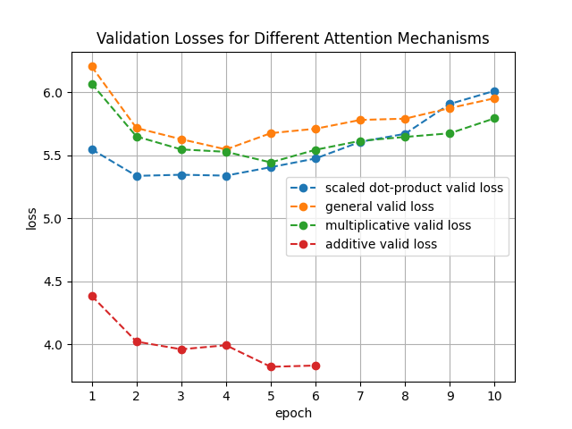
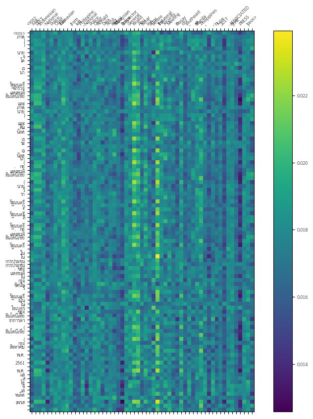
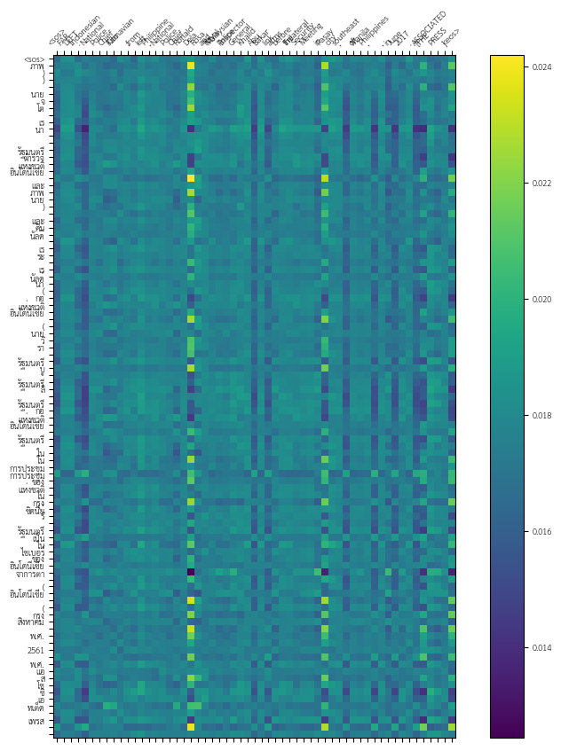
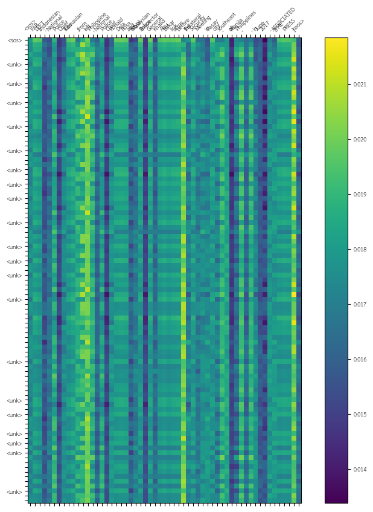
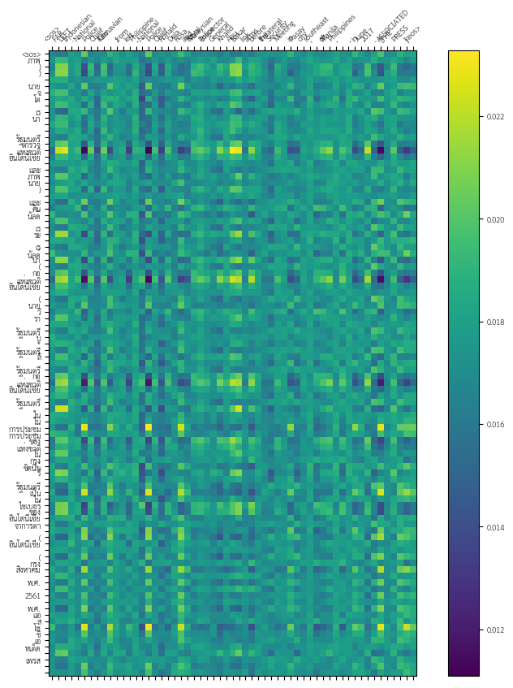

# TrydoDict

## Overview

Welcome to the Machine Translation Demo App! This web-based application demonstrates the basic functionality of a machine translation, allowing users to input a word or sentence in English and retrieve the generated translation in Thai.

## Dataset

The machine translation is trained with a data from [Hugging Face](https://huggingface.co/datasets/scb_mt_enth_2020) which is a large English-Thai parallel corpus, curated from news, Wikipedia articles, SMS messages, task-based dialogs, web-crawled data and government documents.

There are 801,402 rows of English-Thai parallel text in the train dataset, 100,173 rows in the validation dataset, and 100,177 rows in the test dataset. In this repository, the dataset is truncated to 10,000 rows of train dataset, 2,000 rows in validation dataset, and 2,000 rows in test dataset.

## Features

- **Input:** User can enter an English word or sentence in the provided input section.
- **Submit Button:** User clicks *submit* after typing the prompt. The app will generate the translation from the provided text.
- **Generated Translation:** A translation will be generated and shown next to the submit button. The app might give &lt;unk&gt; in the generated text if the input contains unknown word or when the app sees that is appropriate.

## Application

### Prerequisites

- Ensure you have Python installed

### Installation

1. Clone the repository:

   ```bash
   git clone https://github.com/thassung/TrydoDict.git
   ```

2. Install the required Python dependencies:

   ```bash
   pip install flask torch
   ```

3. Navigate to the app directoty:
   ```bash
   cd TrydoDict/app
   ```

4. Start the flask application:
   ```bash
   python main.py
   ```

   You can access the application via http://localhost:8080

## Evaluation

### Loss and Perplexity

| Attention | Training Loss | Training PPL | Validation Loss | Validation PPL |
|----------|---------------|--------------|-----------------|----------------|
| Scaled Dot-product Attention | 4.297 | 73.505 | 5.336 | 207.663 |
| General Attention | 4.184 | 65.617 | 5.546 | 256.115 |
| Multiplicative Attention | 3.949 | 51.903 | 5.443 | 231.157 |
| Additive Attention | 5.361 | 212.896 | 3.821 | 45.644 | 

The evaluation is from evaluations of ten epochs training on each model with different attention mechanisms. The loss and PPL (perplexity) of each model is picked from the epoch with the least validation loss and PPL which is also the evaluation of each model in [model](model). The epoch that yields the least validation loss for each model are

| Attention | Training Loss | Validation Loss | From Epoch | Total Epoch | Avg. Training Time per Epoch | Memory Usage |
|----------|---------------|--------------|-----------------|----------------|----------------|----------------|
| Scaled Dot-product Attention | 4.297 | 5.336 | 2 | 10 | 47.5 s | 4.89 GB |
| General Attention | 4.184 | 5.546 | 4 | 10 | 46.3 s | 4.89 GB |
| Multiplicative Attention | 3.949 | 5.443 | 5 | 10 | 47.2 s | 4.99 GB |
| Additive Attention | 5.361 | 3.821 | 5 | 6 | 2 s | 12.46 GB |

The number of trained epoch for the MT with additive attention is only 6 because of the available memory is not sufficient to handle additional linear layers for more than 6 epochs. In addition, the number of data rows used to train the MT with additive attention is much smaller—200 rows for training, 40 rows for validation, and 40 rows for training. The comparison between the MT and the three other MTs should be done with this fact in mind that it will not be entirely appropriate to do so.




Considering only the three models that are trained with the same size of dataset, the model with scaled dot-product attention mechanism has reached the smallest validation loss (the best performance) at its second epoch followed by multiplicative attention and general attention respectively. The computational loads are very close to each other (see avg. training time per epoch and memory usage in the above table). To some extent, because their losses and computational loads are similar, it can be said that the three models have similar computational efficiency even though the two models with no additional layer, scaled dot-product and general attention, are expected to use lower computional power. Here, additive attention aside is unarguably the worst in computational efficiency due to the astronomical memory usage.

### Attention

<table>
  <tr>
    <td>
      
      <p>Description: Scaled dot-product attention mechanism visualized against epoch.</p>
    </td>
    <td>
      
      <p>Description: General attention mechanism visualized against epoch.</p>
    </td>
  </tr>
  <tr>
    <td>
      
      <p>Description: Additive attention mechanism visualized against epoch.</p>
    </td>
    <td>
      
      <p>Description: Multiplicative attention mechanism visualized against epoch.</p>
    </td>
  </tr>
</table>
