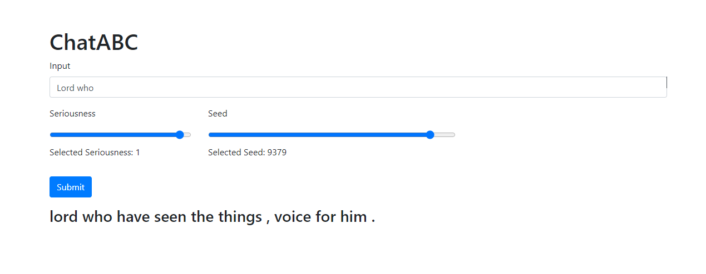

# ChatABC

## Overview

Welcome to the Language Model Demo App! This web-based application demonstrates the basic functionality of a language model, allowing users to input a prompt and retrieve the generated text based on the prompt and input temperature (seriousness) and seed.

## Features

- **Input:** User can enter a prompt in the provided input section.
- **Seriouness:** User can select temperature from 0 to 1 for the text generation. The higher temperature will yield a more sensible text with a trade off of creativity.
- **Seed:** User can choose the seed to generate the text. Different seeds will give different text. 
- **Submit Button:** User click submit after typing the prompt. The model will generate the text initiated with the prompt.
- **Generated Text:** A text will be generated and shown next to the submit button. If the input prompt contains any word unknown to the model, it will replace the word with &lt;unk&gt; instead.
- **Dataset:** The language model was trained with data from [Project Gutenberg](https://gutenberg.org/) provided in [NLTK corpora](https://github.com/nltk/nltk_data/blob/gh-pages/packages/corpora/). 

### Prerequisites

- Ensure you have Python installed

### Installation

1. Clone the repository:

   ```bash
   git clone https://github.com/thassung/ChatABC.git
   ```

2. Install the required Python dependencies:

   ```bash
   pip install flask torch torchtext
   ```

3. Navigate to the app directoty:
   ```bash
   cd ChatABC/app
   ```

4. Start the flask application:
   ```bash
   python main.py
   ```

   You can access the application via http://localhost:8080


